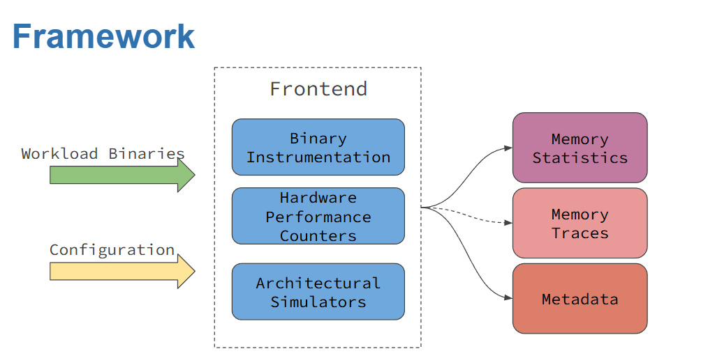

1. Getting Started
==================

This section provides a comprehensive guide to installing and setting up the **MemSysExplorer Application Profiler**, the top layer of the MemSysExplorer framework.

The profiler is designed to extract detailed memory access patterns and performance metrics from real applications, enabling subsequent analysis and modeling of memory technologies such as DRAM, HBM, and NVM. It supports a variety of workloads across both **CPU and GPU platforms**, and acts as the **entry point for generating structured profiling data** for downstream memory simulation and evaluation.

The overall profiling workflow is shown in Figure 1, which includes three categories of supported profilers:

- **Architecture-Independent Profilers**  
  Tools like **DynamoRIO** that use dynamic binary instrumentation (DBI) to analyze memory behavior independent of specific hardware.

- **Architecture-Dependent Profilers**  
  Tools such as **Perf** and **NVIDIA Nsight Compute**, which use hardware performance counters to collect platform-specific metrics.

- **Architectural Simulators**  
  Tools like **Sniper Simulator**, which model the entire memory hierarchy to provide cycle-level timing and bandwidth evaluation.

.. important::

   **MemSysExplorer GitHub Repository**

   Explore the codebase, raise issues, or contribute at: https://github.com/lpentecost/MemSys-Playground/tree/gpu-app/apps
   
   To learn more about license terms and third-party attribution, refer to the :doc:`licensing` page.

   *Figure 1: MemSysExplorer Application Profiling Framework*

1.1 Supported Profilers
-----------------------

The following profilers are available in MemSysExplorer. Each has a dedicated directory in the GitHub repository. Refer to the linked folders for implementation details and advanced usage examples:

- **DynamoRIO** — Dynamic binary instrumentation for CPU
  `DynamoRIO Source Code <https://github.com/lpentecost/MemSys-Playground/tree/gpu-app/apps/profilers/dynamorio>`_

- **Perf** — Linux hardware performance counters
  `Perf Source Code <https://github.com/lpentecost/MemSys-Playground/tree/gpu-app/apps/profilers/perf>`_

- **Sniper** — Architectural simulator for multicore systems
  `Sniper Source Code <https://github.com/lpentecost/MemSys-Playground/tree/gpu-app/apps/profilers/sniper>`_

- **NVBit** — GPU binary instrumentation for CUDA applications
  `NVbit Source Code <https://github.com/lpentecost/MemSys-Playground/tree/gpu-app/apps/profilers/nvbit>`_

- **Nsight Compute (NCU)** — NVIDIA tool for GPU memory statistics
  `Nsight Compute Source Code <https://github.com/lpentecost/MemSys-Playground/tree/gpu-app/apps/profilers/ncu>`_

.. note::

   GPU frontends such as ``nvbit`` and ``ncu`` should **only be used with GPU workloads**. Attempting to profile CPU binaries with these tools may result in undefined behavior or runtime errors.
 

1.2 Prerequisites
-----------------

To run the MemSysExplorer Application Profiler, the following software dependencies must be installed:

- **CUDA:** Version 10.x or higher
- **CUDA Toolkit:** Version 10.x or higher
- **Python 3:** Version 3.x or higher
- **DynamoRIO:** Latest version
- **GCC:** Latest version

For profilers that rely on **Hardware Performance Counters (HPC)**—such as **Perf** and **NVIDIA Nsight Compute**—additional system configuration is required.

Specifically, you must **enable access to performance counters** at the system level to allow these tools to capture low-level memory statistics. On Linux systems, this often involves modifying `/proc/sys/kernel/perf_event_paranoid` or applying appropriate capabilities using `setcap` or `sudo` privileges.

To enable performance counters on NVIDIA GPUs, please follow the instructions provided at the following link:

`Enabling NVIDIA Performance Counters <https://developer.nvidia.com/nvidia-development-tools-solutions-err_nvgpuctrperm-permission-issue-performance-counters>`_

1.3 Installing the Repository
-----------------------------

To get started with MemSysExplorer, begin by cloning the repository from GitHub. This repository contains the full source code for the application profiler, including frontend tools, example workloads, and configuration scripts.

.. code-block:: bash

   git clone https://github.com/lpentecost/MemSys-Playground.git
   cd MemSys-Playground

The repository includes a top-level `Makefile` that supports building and configuring five available profilers:

- **dynamorio**
- **nvbit**
- **sniper**
- **perf**
- **nsight**

.. important::

   While the provided `Makefile` simplifies the build process, some dependencies must be installed manually using system package managers such as `apt` (e.g., `sudo apt install <library>`).
   Please refer to the :doc:`licensing` page or the official documentation for each tool to ensure you have installed the required development libraries and runtime dependencies before building the profilers in MemSysExplorer.

.. note::

   Before building any of the profilers, you must first **set up the environment**
   using the `setup/setup.sh` (for bash) or `setup/setup.csh` (for tcsh).
   This ensures all compiler paths, libraries, and dependencies are correctly configured.

Among these, the following tools require compilation or setup:

- **dynamorio** – Build the custom DynamoRIO-based instrumentation frontend.
- **nvbit** – Build the NVBit-based GPU binary instrumentation layer.
- **sniper** – Compile and configure the Sniper architectural simulator.

The remaining two frontends rely on system-level availability:

- **perf** – Ensure Linux `perf` is installed and accessible via your system's performance counters (check `perf_event_paranoid` settings if needed).
- **ncu** – Requires the NVIDIA Nsight Compute CLI and proper GPU driver installation.

To build any tool:

.. code-block:: bash

   make <profiler-name>

Example:

.. code-block:: bash

   make dynamorio

To build all tools:

.. code-block:: bash

   make

**Profiler Registration with `built_profilers.json`**

When you run a `make` command for any supported profiler, the `built_profilers.json` file is automatically created and updated to mark that profiler as **active**.

Example:

.. code-block:: json

   {
     "dynamorio": true,
     "nvbit": true,
     "sniper": true,
     "perf": true,
     "ncu": true
   }

You may **manually set any value to `false`** to temporarily disable a profiler without deleting its build.

1.4 Setting Up the Environment
------------------------------

MemSysExplorer provides shell-specific setup scripts to configure all the required environment variables for each supported frontend profiler. These scripts are located in the `setup/` directory and ensure correct paths to toolchains, compilers, libraries, and runtime dependencies.

Each frontend has its own set of environment variables that must be initialized to function correctly. Use the `setup.sh` (for `bash`/`sh`) or `setup.csh` (for `tcsh`/`csh`) script to configure them automatically.

**Setup Options:**

- `1` or `dynamorio` — Setup for CPU instrumentation using **DynamoRIO**
- `2` or `cuda` — Setup for GPU profiling using **NVBit** and **Nsight Compute**
- `3` or `sniper` — Setup for CPU simulation using **Sniper**

**Configured Environment Variables:**

- **DynamoRIO Frontend**  
  `GCC_PATH`, `PATH`, `LD_LIBRARY_PATH`, `LIBRARY_PATH`, `C_INCLUDE_PATH`, `CPLUS_INCLUDE_PATH`

- **CUDA Frontends (NVBit and Nsight Compute)**  
  `CUDA_HOME`, `PATH`, `LD_LIBRARY_PATH`, `NCU_HOME`, `NCU_PARSING`, `PYTHONPATH`

- **Sniper Frontend**  
  `SNIPER_ROOT`, `PIN_HOME`, `PATH`, `LD_LIBRARY_PATH`, `C_INCLUDE_PATH`, `CPLUS_INCLUDE_PATH`, `LD_RUN_PATH` *(optional)*

These scripts eliminate the need to configure the environment manually and ensure all compiler and runtime paths are set consistently.

**Example (tcsh):**

.. code-block:: tcsh

   source setup/setup.csh dynamorio

**Example (bash):**

.. code-block:: bash

   source setup/setup.sh cuda

1.5 Example Usage
-----------------

The MemSysExplorer profiling tool can be executed using the following general command:

.. code-block:: bash

   python3 main.py --profiler <profiler_name> --action <action> --level <memory-level> --executable /path/to/your/executable

**Main Flags:**

- `-p`, `--profiler` — Profiler backend: `dynamorio`, `perf`, `sniper`, `nvbit`, `ncu`
- `-a`, `--action` — Action: `profiling`, `extract_metrics`, `both`
- `--level` — Memory level: `l1`, `l2`, `l3`, `dram`
- `--config` — Optional config file for profilers like `sniper`, `ncu`
- `--ncores` — Number of cores (used with `sniper`)
- `--executable` — Path to the application binary to profile

**Profiler-Specific Examples:**

- **DynamoRIO**

  .. code-block:: bash

     python3 main.py --profiler dynamorio --action profiling --executable /path/to/your/executable

- **Linux Perf**

  .. code-block:: bash

     python3 main.py --profiler perf --action extract_metrics --level l3 --executable /path/to/your/executable

- **Sniper Simulator**

  .. code-block:: bash

     python3 main.py --profiler sniper --action both --level dram \
       --result_dir /path/to/your/output --config config/sniper.cfg --executable /path/to/your/executable

- **NVBit**

  .. code-block:: bash

     python3 main.py --profiler nvbit --action profiling --executable /path/to/your/executable

- **Nsight Compute (NCU)**

  .. code-block:: bash

     python3 main.py --profiler ncu --action extract_metrics --level l1 \
       --config config/ncu_template.json --executable /path/to/your/executable

1.6 Output Samples
------------------

Each profiler in the MemSysExplorer framework produces output traces based on its internal capabilities. Despite differences in instrumentation mechanisms, all profilers conform to a **shared output schema** designed for downstream memory analysis.

Two key output files are generated during each profiling session:

Memory Statistics Trace
~~~~~~~~~~~~~~~~~~~~~~~

This JSON file captures the high-level memory activity observed during the execution.

**File Name Format:**  
A unique identifier (`_<id>`) is automatically appended if a file with the same name already exists to avoid overwriting.

::

    memsyspatternconfig_<workload>.json
    memsyspatternconfig_<workload>_<id>.json  (if duplicate exists)

**Example:**

.. code-block:: json

    {
      "exp_name": "DynamoRIOProfilers",
      "benchmark_name": " ",
      "read_freq": 0.6861362992349107,
      "total_reads": 135597,
      "write_freq": 0.31386370076508924,
      "total_writes": 62027,
      "read_size": 32,
      "write_size": 32,
      "total_writes_i": 1,
      "total_writes_d": 1,
      "total_reads_d": 1,
      "total_reads_i": 1,
      "workingset_size": 1369868,
      "metadata": null,
      "unit": {
        "read_freq": "bytes/s",
        "write_freq": "bytes/s",
        "total_reads": "count",
        "total_writes": "count",
        "read_size": "bytes",
        "write_size": "bytes",
        "workingset_size": "bytes"
      }
    }

Workload Metadata Object
~~~~~~~~~~~~~~~~~~~~~~~~

This file records the **software/hardware context** of the profiling session and captures system architecture, CPU/GPU info, OS, and toolchain metadata.

**File Name Format:**  
As with pattern configs, a unique identifier is appended on conflict:

::

    memsysmetadata_<profiler_name>.json
    memsysmetadata_<profiler_name>_<id>.json  (if duplicate exists)

**Example:**

.. code-block:: json

    {
      "gpu_name": "NVIDIA GeForce RTX 4080 SUPER",
      "driver_version": "560.94",
      "gpu_memory_MB": 16376,
      "cpu_info": {
        "Architecture": "x86_64",
        "CPU op-mode(s)": "32-bit, 64-bit",
        "Address sizes": "39 bits physical, 48 bits virtual",
        "Model name": "Intel(R) Core(TM) i7-14700KF",
        "L3 cache": "33 MiB (1 instance)"
      },
      "cpu_cache": {
        "L1d": "48K",
        "L1i": "32K",
        "L2": "2048K",
        "L3": "33792K"
      },
      "dram_size_MB": 15848,
      "software_info": {
        "OS": "Linux 5.15.167.4-microsoft-standard-WSL2",
        "Kernel": "5.15.167.4-microsoft-standard-WSL2",
        "gcc_version": "gcc (Ubuntu 11.4.0) 11.4.0",
        "FileSystem": "ext4"
      },
      "dynamorio_version": "11.3.0"
    }

These are the two **core output traces** produced by all profilers in the MemSysExplorer framework:

- ``memsyspatternconfig_<workload>.json`` — memory statistics trace  
- ``memsyspatternconfig_<workload>_<id>.json`` — trace file with a counter to avoid overwrites  
- ``memsysmetadata_<profiler_name>.json`` — system and environment metadata  
- ``memsysmetadata_<profiler_name>_<id>.json`` — metadata file with a counter if needed

For additional profiler-specific outputs, refer to the respective sections under :doc:`profilers`.

1.7 Profiler-Specific Configurations
------------------------------------

Each profiler may require additional specific arguments. Refer to the **Profilers** section for detailed information on the necessary flags and options for each profiler.

By following these steps, you can effectively profile your applications and gain valuable insights into memory usage patterns.

This framework supports a variety of workloads across both CPU and GPU platforms,
and acts as the entry point for generating structured profiling data for downstream simulation.

To learn more about license terms and third-party attribution, refer to the :doc:`licensing` page.
